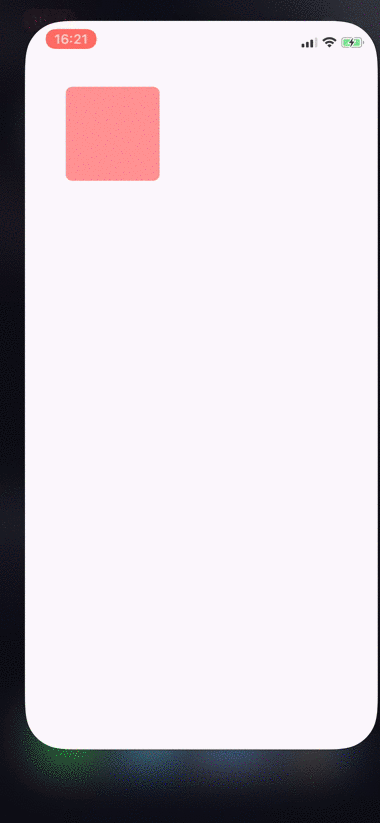
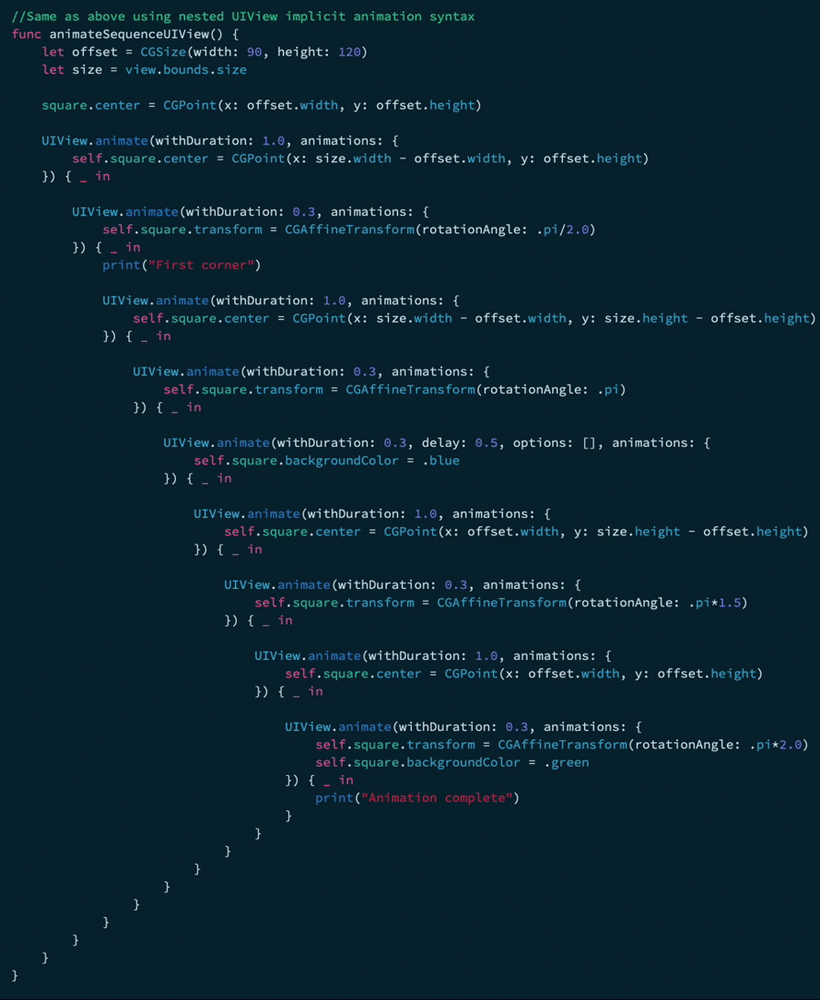

# SequenceAnimator

A wrapper for UIView animation which makes it easy to write sequences of animations 

So instead of writing:

```swift
    UIView.animate(withDuration: 0.5, animations: {
        //Some animation
    }) { done in
        UIView.animate(withDuration: 0.5, animations: {
            //Do another animation after the first...
        }, completion: ...)
    }
```
You write:

```swift
    SequenceAnimator.animate(0.5) {
        //Some animation
    }.animate(0.5) {
        //Another animation after the first
    }.done {
        //We're done
    }
```
   
You can intersperse `done` blocks throughout the chained animations and also use delays   

Take a look the included demo app



Which includes a comparison of implicit `UIView` animation syntax with `SequenceAnimator`



# Installation

Copy SequenceAnimator.swift to your project
